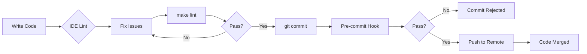

# golangci-lint Guide

Complete guide to using golangci-lint in this project.

## Table of Contents

1. [Introduction](#introduction)
2. [Architecture Flow](#architecture-flow)
3. [Installation](#installation)
4. [Configuration](#configuration)
5. [Enabled Linters](#enabled-linters)
6. [Common Issues & Fixes](#common-issues--fixes)
7. [IDE Integration](#ide-integration)
8. [Pre-commit Hook](#pre-commit-hook)
9. [Linting Enforcement](#linting-enforcement)
10. [Troubleshooting](#troubleshooting)
11. [Best Practices](#best-practices)

---

## Introduction

### What is golangci-lint?

golangci-lint is a fast Go linters aggregator that runs multiple linters in parallel, caches results, and provides unified output. It's the industry standard for Go code quality automation.

### Why We Use It

- **Speed**: 5x faster than running linters individually (parallel execution + caching)
- **Comprehensive**: 12 linters covering security, reliability, style, and performance
- **Configurable**: YAML configuration with fine-grained control
- **CI/CD Ready**: Native GitHub Actions integration
- **IDE Support**: Real-time feedback in VS Code, GoLand, and other editors

### What It Checks

- Security vulnerabilities (hardcoded credentials, SQL injection)
- Unchecked errors (critical in Go)
- Code complexity and maintainability
- Style consistency and documentation
- Dead code and unused parameters
- Resource leaks (HTTP bodies, file handles)
- Performance optimizations (slice preallocation)

**Enforcement:** All checks run automatically on every `git commit` via pre-commit hook.

---

## Architecture Flow



**Flow Explanation:**

1. **Development**: IDE shows lint errors in real-time as you code
2. **Pre-commit**: Run `make lint` before committing to catch issues early
3. **Git Hook**: Pre-commit hook automatically blocks commits with lint failures
4. **Push**: Once commit succeeds, code is ready to push (no additional CI lint checks)

**Key Point:** Linting is enforced at **commit time**, not CI time. This provides:
- Immediate feedback (no waiting for CI)
- Faster iteration (fix issues before pushing)
- Cleaner git history (no "fix lint" commits)
- No redundant CI checks

---

## Installation

### Quick Install (Recommended)

```bash
# Using Makefile
make lint-install
```

This runs:
```bash
go install github.com/golangci/golangci-lint/cmd/golangci-lint@latest
```

### Verify Installation

```bash
# Check version (should be v2.10.1 or later)
golangci-lint version

# Check binary location
which golangci-lint
```

### Manual Install

If Makefile is not available:

```bash
# Install latest version
go install github.com/golangci/golangci-lint/cmd/golangci-lint@v2.10.1

# Or install specific version
go install github.com/golangci/golangci-lint/cmd/golangci-lint@latest
```

### PATH Configuration

Ensure `$GOPATH/bin` is in your PATH:

```bash
# Add to ~/.bashrc or ~/.zshrc
export PATH=$PATH:$(go env GOPATH)/bin
```

---

## Configuration

### File Location

Configuration is in `.golangci.yml` at the project root.

### Configuration Breakdown

```yaml
version: "2"

linters:
  default: none
  enable:
    - gosec                            # Security scanner
    - errcheck                         # Unchecked errors
    - staticcheck                      # Advanced static analysis
    - govet                            # Standard Go analyzer
    - revive                           # Configurable linter
    - gocyclo                          # Cyclomatic complexity
    - misspell                         # Spelling checker
    - unparam                          # Unused parameters
    - unused                           # Dead code detection
    - prealloc                         # Slice preallocation
    - bodyclose                        # HTTP response body closing

issues:
  max-issues-per-linter: 0             # No limit on issues
  max-same-issues: 0                   # Show all duplicates

run:
  timeout: 5m                          # Maximum time for linter to run
  modules-download-mode: readonly      # Don't modify go.mod
  allow-parallel-runners: true         # Run linters in parallel (faster)
```

### Why These Settings?

| Setting | Value | Reasoning |
|---------|-------|-----------|
| `timeout` | 5m | Prevents hangs on large codebases |
| `allow-parallel-runners` | true | Speed improvement |
| `max-issues` | 0 | Show all issues, no hiding |
| `version` | "2" | Use golangci-lint v2 format |

---

## Enabled Linters

### Security & Reliability

| Linter | Purpose | Why We Use It | Example Issue |
|--------|---------|---------------|---------------|
| **gosec** | Security vulnerabilities | Prevents hardcoded secrets, SQL injection, weak crypto | `password := "admin123"` |
| **errcheck** | Unchecked errors | Critical for Go error handling | `file.Write(data)` without error check |
| **staticcheck** | Advanced static analysis | Catches bugs before runtime | Using deprecated functions |
| **govet** | Standard Go analyzer | Official tool, catches Printf mismatches | `fmt.Printf("%d", "string")` |
| **bodyclose** | HTTP response bodies | Prevents resource leaks | Missing `defer resp.Body.Close()` |

### Code Quality & Style

| Linter | Purpose | Why We Use It | Example Issue |
|--------|---------|---------------|---------------|
| **revive** | Configurable linter | Enforces exported comments, style | Missing `// User represents...` |
| **gocyclo** | Cyclomatic complexity | Keeps functions readable | Functions with 20+ if/else |
| **misspell** | Spelling checker | Professional code quality | `fucntion`, `recieve` |

### Performance & Optimization

| Linter | Purpose | Why We Use It | Example Issue |
|--------|---------|---------------|---------------|
| **unconvert** | Unnecessary type conversions | Removes redundant type casts | `int(x)` where x is already int |
| **unparam** | Unused parameters | Clean function signatures | `func fn(ctx context.Context, x int)` where x is never used |
| **unused** | Dead code detection | Removes unused variables/types | Unused struct fields, functions |
| **prealloc** | Slice preallocation | Reduces memory allocations | `slice := []T{}` vs `make([]T, 0, cap)` |

---

## Common Issues & Fixes

### 1. Unchecked Error (errcheck)

**Problem:**
```go
// ❌ BEFORE
json.NewEncoder(w).Encode(user)
```

**Solution:**
```go
// ✅ AFTER
if err := json.NewEncoder(w).Encode(user); err != nil {
    http.Error(w, err.Error(), http.StatusInternalServerError)
    return
}
```

**Why:** Go errors must always be handled to prevent silent failures.

---

### 2. Missing Doc Comment (revive)

**Problem:**
```go
// ❌ BEFORE
type User struct {
    ID int64
}

func CreateUser(input CreateUserInput) (*User, error) {
    // ...
}
```

**Solution:**
```go
// ✅ AFTER
// User represents a user in the system.
type User struct {
    ID int64 `json:"id"`
}

// CreateUserInput represents the input for creating a new user.
type CreateUserInput struct {
    Name  string `json:"name"`
    Email string `json:"email"`
}

// CreateUser creates a new user in the database.
func CreateUser(input CreateUserInput) (*User, error) {
    // ...
}
```

**Why:** Exported types and functions must have documentation for public API clarity.

---

### 3. HTTP Timeout Missing (gosec)

**Problem:**
```go
// ❌ BEFORE
http.ListenAndServe(addr, handler)
```

**Solution:**
```go
// ✅ AFTER
server := &http.Server{
    Addr:         addr,
    Handler:      handler,
    ReadTimeout:  15 * time.Second,
    WriteTimeout: 15 * time.Second,
    IdleTimeout:  60 * time.Second,
}
if err := server.ListenAndServe(); err != nil {
    log.Fatal(err)
}
```

**Why:** Prevents slowloris attacks and resource exhaustion from slow clients.

---

### 4. HTTP Response Body Not Closed (bodyclose)

**Problem:**
```go
// ❌ BEFORE
resp, err := http.Get(url)
if err != nil {
    return err
}
data, _ := io.ReadAll(resp.Body)
```

**Solution:**
```go
// ✅ AFTER
resp, err := http.Get(url)
if err != nil {
    return err
}
defer func() {
    _ = resp.Body.Close()
}()
data, _ := io.ReadAll(resp.Body)
```

**Why:** Prevents file descriptor leaks and connection pool exhaustion.

---

### 5. High Cyclomatic Complexity (gocyclo)

**Problem:**
```go
// ❌ BEFORE - Complexity: 25
func ProcessRequest(r *http.Request) error {
    if condition1 {
        // 5 lines
    } else if condition2 {
        // 5 lines
    } else if condition3 {
        // 5 lines
    }
    // ... 10 more if/else branches
}
```

**Solution:**
```go
// ✅ AFTER - Extract into smaller functions
func ProcessRequest(r *http.Request) error {
    switch {
    case condition1:
        return handleCase1(r)
    case condition2:
        return handleCase2(r)
    case condition3:
        return handleCase3(r)
    }
}

func handleCase1(r *http.Request) error { /* ... */ }
func handleCase2(r *http.Request) error { /* ... */ }
func handleCase3(r *http.Request) error { /* ... */ }
```

**Why:** Functions with complexity > 15 are hard to test and maintain.

---

### 6. Unused Function Parameter (unparam)

**Problem:**
```go
// ❌ BEFORE
func getUserByID(w http.ResponseWriter, r *http.Request, id int64) {
    user := getUser(id)
    // 'r' is never used
}
```

**Solution:**
```go
// ✅ AFTER
func getUserByID(w http.ResponseWriter, id int64) {
    user := getUser(id)
}
```

**Why:** Unused parameters confuse readers and suggest incomplete implementation.

---

### 7. Slice Preallocation (prealloc)

**Problem:**
```go
// ❌ BEFORE
var users []*User
for _, row := range rows {
    users = append(users, &User{...})
}
```

**Solution:**
```go
// ✅ AFTER (when size is known)
users := make([]*User, 0, len(rows))
for _, row := range rows {
    users = append(users, &User{...})
}
```

**Why:** Reduces memory allocations and improves performance.

---

## IDE Integration

### VS Code

**Install Extension:**
- Go extension by Go team at Google (golang.go)

**settings.json:**
```json
{
  "go.lintTool": "golangci-lint",
  "go.lintOnSave": "workspace",
  "go.lintFlags": ["--timeout=5m"],
  "go.toolsManagement.autoUpdate": true
}
```

**Verification:**
- Open a Go file
- Make an intentional error (e.g., unused variable)
- Should see red squiggly line immediately

---

### GoLand (JetBrains)

**Setup:**
1. Go to **Settings** → **Go** → **Linters**
2. Enable **golangci-lint**
3. Set binary path: `~/go/bin/golangci-lint`
4. Set config file: `.golangci.yml`
5. Click **Apply**

**Verification:**
- Open a Go file
- Errors appear in editor and "Problems" tool window

---

### Vim/Neovim

**Using vim-go:**
```vim
let g:go_metalinter_autosave = 1
let g:go_metalinter_command = "golangci-lint"
```

**Using ALE:**
```vim
let g:ale_linters = {
\   'go': ['golangci-lint'],
\}
```

---

## Pre-commit Hook

### What is a Pre-commit Hook?

A Git hook that runs automatically before each commit, blocking commits with lint failures.

### Installation

```bash
# Copy hook to git directory
cp .github/hooks/pre-commit .git/hooks/pre-commit

# Make executable
chmod +x .git/hooks/pre-commit

# Verify installation
ls -la .git/hooks/pre-commit
```

### How It Works

1. Run `git commit -m "message"`
2. Git executes `.git/hooks/pre-commit`
3. Hook runs `make lint`
4. If lint fails → commit rejected
5. If lint passes → commit proceeds

### Bypassing (Emergency Only)

```bash
# Skip pre-commit hook (use sparingly)
git commit -m "message" --no-verify
```

**Warning:** Bypassing the hook allows commits with lint issues. Use only in emergencies and fix lint issues immediately after.

---

## Linting Enforcement

### Commit-Time Enforcement

This project enforces linting at **commit time** via pre-commit hook, not in CI.

**Benefits:**
- ✅ **Immediate feedback**: Catch issues before pushing
- ✅ **Faster development**: No waiting for CI to fail
- ✅ **Cleaner history**: No "fix lint" commits
- ✅ **Simpler CI**: No redundant lint checks in CI pipeline
- ✅ **Developer autonomy**: You control when to fix issues

**How It Works:**
1. Pre-commit hook installed via `cp .github/hooks/pre-commit .git/hooks/`
2. Every `git commit` triggers `make lint`
3. If lint fails → commit rejected with helpful error message
4. If lint passes → commit proceeds normally

**No CI Lint Checks:**
Unlike many projects, we do NOT run golangci-lint in CI because:
- Pre-commit hook already guarantees linted code
- CI checks would be redundant and slow
- Trust developers to use the hook (or bypass responsibly)

**Exception:** If someone bypasses the hook (`--no-verify`) and pushes broken code:
- Fix in next commit (add to PR checklist)
- Consider team discussion (not automated enforcement)
- Document bypass in commit message

---

## Troubleshooting

### Common Issues

| Issue | Cause | Solution |
|-------|-------|----------|
| `golangci-lint: command not found` | Not in PATH | Run `make lint-install` and add `$GOPATH/bin` to PATH |
| `version mismatch (expected v2.10.1)` | Old installation | Re-run `make lint-install` |
| Pre-commit hook fails but `make lint` passes | Hook PATH issue | Check hook uses full path: `export PATH=$PATH:$(go env GOPATH)/bin` |
| Slow linter performance | No caching | Clear cache with `golangci-lint cache clean` |
| False positive on specific line | Linter bug or edge case | Use `//nolint:lintname` directive |
| Too many issues to fix at once | Large codebase, new linter | Run `golangci-lint run --new-from-rev=HEAD~5` for recent changes only |

### Ignoring Specific Lines

```go
// Ignore gosec on this line (e.g., known safe SQL)
//nolint:gosec
db.Exec("SELECT * FROM users WHERE id = " + id)

// Ignore multiple linters
//nolint:gosec,errcheck
result := db.Query(sql)

// Ignore entire function
//nolint:gocyclo
func complexFunction() {
    // ...
}
```

**Warning:** Use `//nolint` sparingly and always specify the linter name.

### Clearing Cache

```bash
# Clear golangci-lint cache
golangci-lint cache clean

# Clear Go build cache
go clean -cache
```

### Debug Mode

```bash
# Verbose output
golangci-lint run -v

# Print issued warnings
golangci-lint run --print-issued-lines=false
```

---

## Best Practices

### 1. Fix Issues Immediately

**Do:**
- Fix lint errors as soon as IDE shows them
- Run `make lint` before committing

**Don't:**
- Accumulate lint issues
- Leave "will fix later" comments

---

### 2. Never Ignore Warnings Without Reason

**Bad:**
```go
//nolint
someFunction()  // Why is this ignored?
```

**Good:**
```go
//nolint:gosec
// SQL injection not possible here - id is UUID validated above
db.Exec("SELECT * FROM users WHERE id = '" + id + "'")
```

---

### 3. Keep Functions Simple

**Target Metrics:**
- Cyclomatic complexity: < 15
- Function length: < 50 lines
- Parameters: < 4

**If exceeded:**
- Extract helper functions
- Use strategy pattern for complex conditionals
- Consider interfaces for dependency injection

---

### 4. Document All Exported Items

**Required:**
- Every exported type: `// User represents...`
- Every exported function: `// CreateUser creates...`
- Every package: `// Package models defines...`

**Not required:**
- Unexported (lowercase) items
- Test functions

---

### 5. Always Close Resources

**HTTP Responses:**
```go
resp, err := http.Get(url)
// ...
defer func() {
    _ = resp.Body.Close()
}()
```

**Database Rows:**
```go
rows, err := db.Query(sql)
// ...
defer func() {
    _ = rows.Close()
}()
```

**Files:**
```go
file, err := os.Open(path)
// ...
defer func() {
    _ = file.Close()
}()
```

---

### 6. Handle All Errors

**Never:**
```go
result, _ := riskyOperation()  // Ignoring error!
```

**Always:**
```go
result, err := riskyOperation()
if err != nil {
    return fmt.Errorf("operation failed: %w", err)
}
```

**Exception:**
```go
// Only when failure is truly acceptable
_ = listener.Close()  // Can't do anything if this fails
```

---

### 7. Write Testable Code

**Hard to test:**
```go
func ProcessData() error {
    db := connectToDatabase()  // Hidden dependency
    // ...
}
```

**Easy to test:**
```go
func ProcessData(db *sql.DB) error {
    // ...
}
```

---

### 8. Pre-commit Checklist

Before committing:
- [ ] `make lint` passes
- [ ] All new functions have doc comments
- [ ] All errors are handled
- [ ] All resources are closed
- [ ] No unused imports/variables
- [ ] Tests updated (if applicable)

---

## Quick Reference

### Commands

```bash
# Install
make lint-install

# Run
make lint

# Run with auto-fix
golangci-lint run --fix

# Run on specific file
golangci-lint run path/to/file.go

# Run specific linter
golangci-lint run --disable-all --enable=gosec

# Show help
golangci-lint help

# Clear cache
golangci-lint cache clean
```

### Configuration

**File:** `.golangci.yml`  
**Version:** v2.10.1  
**Go Version:** 1.26+

### Key Thresholds

- Cyclomatic complexity: 15
- Timeout: 5 minutes
- Enabled linters: 12

---

## Resources

- [Official Documentation](https://golangci-lint.run/)
- [Linter List](https://golangci-lint.run/usage/linters/)
- [Configuration Reference](https://golangci-lint.run/usage/configuration/)
- [GitHub Actions Integration](https://github.com/golangci/golangci-lint-action)
