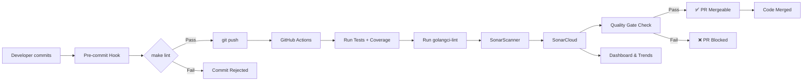
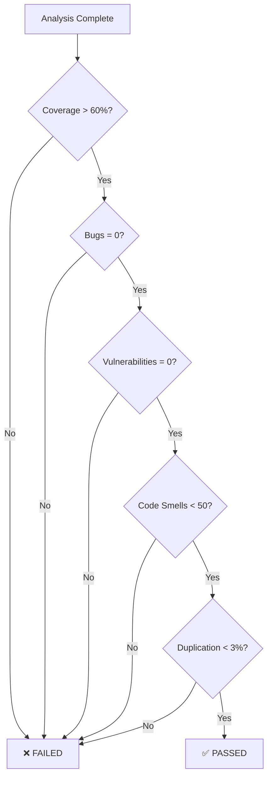

# SonarCloud Integration Guide

Complete guide to integrating SonarCloud for automated code quality analysis.

## Table of Contents

1. [What is SonarCloud?](#what-is-sonarcloud)
2. [Why SonarCloud?](#why-sonarcloud)
3. [Architecture Flow](#architecture-flow)
4. [Quick Start (5 minutes)](#quick-start-5-minutes)
5. [Detailed Setup](#detailed-setup)
6. [Quality Gates](#quality-gates)
7. [Running Analysis](#running-analysis)
8. [Understanding Results](#understanding-results)
9. [Troubleshooting](#troubleshooting)
10. [Best Practices](#best-practices)

---

## What is SonarCloud?

SonarCloud is a **cloud-based code quality and security analysis service** (SaaS) by SonarSource. It provides:

- **Automated Code Review**: Detects bugs, vulnerabilities, and code smells
- **Coverage Analysis**: Tracks test coverage over time
- **Quality Gates**: Pass/fail thresholds for code quality
- **PR Decoration**: Inline comments on GitHub pull requests
- **Trend Analysis**: Track code quality improvements over time
- **Multi-language Support**: Go + 30+ other languages

**Free for:** Public repositories and open-source projects

---

## Why SonarCloud?

| Feature | Benefit |
|---------|---------|
| **Cloud-hosted** | No infrastructure to maintain (unlike self-hosted SonarQube) |
| **GitHub Integration** | Automatic PR comments, status checks |
| **Go Support** | Native analysis for Go code patterns |
| **golangci-lint Integration** | Import existing lint rules (11 linters) |
| **Free Tier** | Unlimited analyses for public repos |
| **Fast Setup** | 5 minutes to first analysis |
| **Quality Gates** | Automated quality enforcement |

**vs golangci-lint:**
- golangci-lint: Local linting, immediate feedback
- SonarCloud: Centralized dashboard, trend tracking, PR integration
- **Together**: Comprehensive quality assurance

---

## Architecture Flow



**Key Points:**
1. Pre-commit hook ensures code is linted before push
2. CI workflow runs tests and coverage analysis
3. golangci-lint SARIF report imported as SonarQube issues
4. Quality Gate determines if PR can merge
5. Dashboard shows long-term quality trends

---

## Quick Start (5 minutes)

### Step 1: Create SonarCloud Account (2 min)

1. Go to https://sonarcloud.io
2. Click **Sign In** → Choose **GitHub**
3. Authorize SonarCloud to access your GitHub account
4. ✅ Account created!

### Step 2: Create Organization (1 min)

1. After login, click your avatar → **Organization Settings**
2. Note your **Organization Key** (usually your GitHub username)
3. You'll need this for configuration

### Step 3: Create Project (1 min)

1. Click **+** → **Analyze new project**
2. Select your GitHub repository
3. Set up project:
   - **Project Key**: `YOUR_USERNAME_YOUR_REPO` (e.g., `john_doe_go-rest-api`)
   - **Display Name**: `Go REST API`
   - **Visibility**: Public (free) or Private
4. Click **Set Up**

### Step 4: Generate Token (1 min)

1. Go to **My Account** → **Security**
2. Under **Tokens**, click **Generate**
3. Name: `go-rest-api-token`
4. Type: **User Token**
5. Click **Generate**
6. **Copy the token** (you won't see it again!)

### Step 5: Configure Project (30 sec)

Update `sonar-project.properties`:

```properties
sonar.projectKey=YOUR_USERNAME_YOUR_REPO
sonar.organization=YOUR_GITHUB_USERNAME
```

### Step 6: Add GitHub Secrets (1 min)

1. Go to your GitHub repository
2. Settings → **Secrets and variables** → **Actions**
3. Add two secrets:
   - **Name**: `SONAR_TOKEN`
   - **Value**: Paste your SonarCloud token
4. (Optional) Add repository variables:
   - **Name**: `SONAR_ORGANIZATION`
   - **Value**: Your organization key
   - **Name**: `SONAR_PROJECT_KEY`
   - **Value**: Your project key

### Step 7: First Analysis

```bash
# Push to trigger CI
git push origin main

# Or run locally
export SONAR_TOKEN=your_token_here
bash scripts/sonar-scanner.sh
```

### Step 8: View Results

Go to: https://sonarcloud.io/dashboard?id=YOUR_PROJECT_KEY

✅ **Done!** Your code is now being analyzed.

---

## Detailed Setup

### Project Configuration

**File:** `sonar-project.properties`

```properties
# Required
sonar.projectKey=YOUR_GITHUB_USERNAME_YOUR_PROJECT_KEY
sonar.organization=YOUR_SONARCLOUD_ORGANIZATION

# Display name
sonar.projectName=Go REST API

# Source code
sonar.sources=.
sonar.sourceEncoding=UTF-8

# Test configuration
sonar.tests=.
sonar.test.inclusions=**/*_test.go

# Coverage report
sonar.go.coverage.reportPaths=coverage.out

# golangci-lint SARIF report
sonar.externalIssuesReportPaths=golangci-lint.sarif

# Git integration
sonar.scm.provider=git
```

### GitHub Secrets Setup

**Navigate to:** Repository Settings → Secrets and variables → Actions

**Required Secrets:**

| Secret Name | Value | Purpose |
|-------------|-------|---------|
| `SONAR_TOKEN` | Your SonarCloud token | Authentication |

**Optional Variables:**

| Variable Name | Value | Purpose |
|---------------|-------|---------|
| `SONAR_ORGANIZATION` | Your org key | Project identification |
| `SONAR_PROJECT_KEY` | Your project key | Project identification |

**Note:** If you don't set variables, the workflow uses `sonar-project.properties` values.

---

## Quality Gates

### Current Thresholds

| Metric | Threshold | Status |
|--------|-----------|--------|
| **Coverage** | > 60% | ✅ Pass |
| **Bugs** | 0 | ✅ Pass |
| **Vulnerabilities** | 0 | ✅ Pass |
| **Code Smells** | < 50 | ✅ Pass |
| **Duplication** | < 3% | ✅ Pass |
| **Maintainability** | A | ✅ Pass |

### Quality Gate Logic



### Customizing Quality Gates

1. Go to your project in SonarCloud
2. **Project Settings** → **Quality Gates**
3. Click **+** to add conditions
4. Set your thresholds

**Example custom gate:**
- New bugs: `= 0`
- New vulnerabilities: `= 0`
- New security hotspots: `= 0`
- Coverage on new code: `> 80%`
- Technical debt ratio: `< 5%`

---

## Running Analysis

### Local Analysis (Development)

```bash
# Set your SonarCloud token
export SONAR_TOKEN=your_token_here

# Run tests with coverage
go test ./handlers -coverprofile=coverage.out

# Run golangci-lint (generate SARIF report)
golangci-lint run --out-format=sarif:golangci-lint.sarif

# Run SonarScanner
bash scripts/sonar-scanner.sh
```

### CI Analysis (Automatic)

On every push to `main` or PR:

1. Tests run with coverage
2. golangci-lint generates SARIF report
3. SonarScanner uploads to SonarCloud
4. Quality Gate determines pass/fail
5. PR gets decorated with results

### Makefile Targets

```bash
# Run tests with coverage
make coverage

# Run SonarScanner (requires SONAR_TOKEN env)
make sonar-scan

# View coverage in browser
make coverage-html
```

---

## Understanding Results

### Dashboard Overview

**Metrics displayed:**

1. **Code**: Lines of code, files, functions
2. **Issues**: Bugs, vulnerabilities, code smells
3. **Coverage**: Test coverage percentage
4. **Duplication**: Duplicate code blocks
5. **Complexity**: Cyclomatic complexity
6. **Maintainability**: A-F rating

### Issue Categories

| Type | Severity | Example |
|------|----------|---------|
| **Bug** | Critical | Nil pointer dereference |
| **Vulnerability** | Critical | Hardcoded credentials |
| **Security Hotspot** | Medium | SQL query construction |
| **Code Smell** | Minor/Major | Complex function, unused variable |
| **Coverage** | Info | Untested function |

### Issue Severity Levels

- **Blocker**: Immediate fix required
- **Critical**: High priority
- **Major**: Should be fixed
- **Minor**: Nice to fix
- **Info**: Informational

### Coverage Interpretation

**Coverage = (Covered Lines / Total Lines) × 100**

**Example:**
```
Total lines: 500
Covered lines: 300
Coverage: 60% ✅ (passes gate)
```

**Green (Good):** > 80%
**Yellow (Warning):** 60-80%
**Red (Fail):** < 60%

---

## Troubleshooting

### Common Issues

| Problem | Cause | Solution |
|---------|-------|----------|
| `Authentication failed` | Invalid token | Regenerate token in SonarCloud, update GitHub secret |
| `Project not found` | Wrong project key | Check `sonar-project.properties` matches SonarCloud project |
| `No coverage data` | Tests not run or wrong path | Ensure `go test -coverprofile=coverage.out` runs before SonarScanner |
| `Quality Gate failed` | Metrics below threshold | Fix issues or adjust thresholds in SonarCloud settings |
| `SARIF import failed` | Invalid format | Use `--out-format=sarif` with golangci-lint |
| `Scanner download fails` | Network issue | Download manually from https://docs.sonarsource.com/sonarqube/latest/analyzing-source-code/scanners/sonarscanner-cli/ |

### Debug Mode

Enable verbose logging:

```bash
# Local
SONAR_SCANNER_OPTS="-X" bash scripts/sonar-scanner.sh

# GitHub Actions
# Add to workflow:
- name: SonarCloud Scan
  run: sonar-scanner -X ...
```

### Check Analysis Status

1. Go to SonarCloud dashboard
2. Click **Activity** tab
3. See all analysis runs with timestamps

### Re-run Failed Analysis

```bash
# Local
rm -f coverage.out golangci-lint.sarif
make coverage
make sonar-scan

# GitHub Actions
# Go to Actions tab → Select workflow run → Click "Re-run jobs"
```

---

## Best Practices

### 1. Run Tests Before Analysis

Always generate fresh coverage data:
```bash
go test ./handlers -coverprofile=coverage.out
```

### 2. Import golangci-lint Results

Convert existing lint rules to SonarQube issues:
```bash
golangci-lint run --out-format=sarif:golangci-lint.sarif
```

### 3. Focus on New Code

Prioritize fixing issues in **new code** (changed in PR):
- Set Quality Gate to check "New Code" metrics
- Don't fix legacy code unless critical

### 4. Keep Coverage Reasonable

**Target:** 60-80%
- Too low (< 60%): Not enough tests
- Too high (> 90%): Diminishing returns

### 5. Address Critical Issues First

Priority order:
1. **Bugs** (runtime errors)
2. **Vulnerabilities** (security issues)
3. **Security Hotspots** (potential security issues)
4. **Major Code Smells** (maintainability)

### 6. Use Quality Gates Wisely

Start lenient, tighten over time:
- **Week 1**: Coverage > 40%, Bugs = 0
- **Month 1**: Coverage > 60%, No critical issues
- **Month 3**: Coverage > 80%, A maintainability

### 7. Review PR Decoration

SonarCloud adds inline comments on GitHub PRs:
- Review suggestions before merging
- Fix issues in PR (not after merge)

### 8. Track Trends

Use SonarCloud dashboard to monitor:
- Coverage trend over time
- Issue density (issues per KLOC)
- Technical debt ratio

---

## Links & Resources

- **SonarCloud Dashboard**: https://sonarcloud.io
- **Documentation**: https://docs.sonarcloud.io
- **Go Rules**: https://rules.sonarsource.com/go
- **GitHub Integration**: https://docs.sonarcloud.io/advanced-setup/ci-based-analysis/github-integration
- **Quality Gates**: https://docs.sonarcloud.io/user-guide/quality-gates/

---

## Quick Reference

```bash
# Setup (one-time)
# 1. Create SonarCloud account
# 2. Generate token
# 3. Add to GitHub secrets (SONAR_TOKEN)
# 4. Update sonar-project.properties

# Run locally
export SONAR_TOKEN=your_token
make coverage
make sonar-scan

# View results
# https://sonarcloud.io/dashboard?id=YOUR_PROJECT_KEY

# CI workflow
# Automatic on push to main or PR
```

---

**Questions?** Check [SonarCloud Community](https://community.sonarsource.com/) or [Documentation](https://docs.sonarcloud.io).
